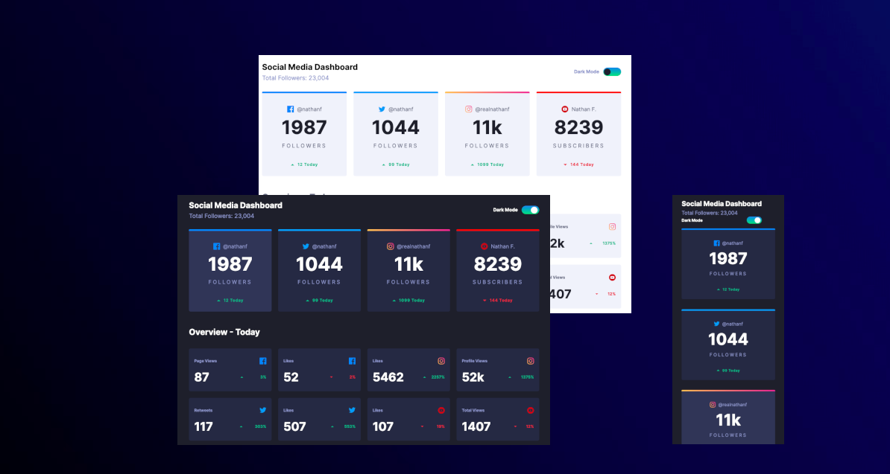

# Frontend Mentor - Social media dashboard with theme switcher solution

This is a solution to the [Social media dashboard with theme switcher challenge on Frontend Mentor](https://www.frontendmentor.io/challenges/social-media-dashboard-with-theme-switcher-6oY8ozp_H). Frontend Mentor challenges help you improve your coding skills by building realistic projects. 

## Table of contents

- [Overview](#overview)
  - [The challenge](#the-challenge)
  - [Screenshot](#screenshot)
  - [Links](#links)
- [My process](#my-process)
  - [Built with](#built-with)
  - [Code Snippets](#code-snippets)
  - [Continued development](#continued-development)
  - [Useful resources](#useful-resources)
- [Author](#author)
- [Tags](#tags)

## Overview

### The challenge

Users should be able to:

- View the optimal layout for the site depending on their device's screen size
- See hover states for all interactive elements on the page
- Toggle color theme to their preference

### Screenshot



### Links

- [Solution URL](https://www.frontendmentor.io/solutions/social-media-dashboard-styledcomponents-tailwindcss-and-ts-KDCABL0NjN)
- [Live Site URL](https://cipivlad.github.io/social_media_dashboard/)

## My process

### Built with

- vite
- [Tailwind](https://tailwindcss.com/)
- [React](https://reactjs.org/) - JS library
- [Styled Components](https://styled-components.com/)

### Code Snippets
#### Process


#### App Overview
```js

function App() {
  const [toggle, setToggle] = useState<boolean>(true)
  return (
    <ThemeProvider theme={toggle ? theme.dark : theme.light}  >
      <BackGroundDark>
        <BackgroundCardTop>
          <div className="App AppOnMobile" style={toggle ? theme.dark : theme.light}>
            <Navbar toggle={toggle} setToggle={setToggle} />
            <TotalFollowerList toggle={toggle} setToggle={setToggle} />
            <FollowerTodayList toggle={toggle} setToggle={setToggle} />
          </div>
        </BackgroundCardTop>
      </BackGroundDark>
    </ThemeProvider >
  )
}

```

##### Models: Set Up Model and add Data

```js
// data flow

import up from '../../public/images/icon-up.svg'
import down from '../../public/images/icon-down.svg'

// data set for TotalFollower

//DataSet.ts
export type FollowerListData = {
    coloredLine: string,
    icon: string,
    username: string,
    followers: string,
    ratingIcon: string,
    ratingNumber: number,
    ratingDay: string
    followerTitle: string
}

export const FaceBookData: FollowerListData =
{
    coloredLine: '#1690f5',
    icon: faceBook,
    username: '@nathanf',
    followers: "1987",
    ratingIcon: up,
    ratingNumber: 12,
    ratingDay: 'Today',
    followerTitle: "FOLLOWERS",
}
```

##### Components And Card
```js

// FollowerTodayList.tsx Components
const FollowerTodayList = ({ toggle, setToggle }: ToggleProps) => {
    return (
        <>
            <h2 className="self-end" style={{ color: toggle ? "hsl(0, 0%, 100%)" : "hsl(228, 12%, 44%)", fontWeight: "700", fontSize: "25px" }}>Overview - Today</h2>
            <div className="grid grid-cols-4 grid-rows-2 gap-5 pt-4">
                {
                    FollowerTodayDataList.map((ele, idx) => (
                        <FollowerTodayCard
                            key={idx}
                            title={ele.title}
                            icon={ele.icon}
                            number={ele.number}
                            ratingIcon={ele.ratingIcon}
                            ratingNumber={ele.ratingNumber}
                            toggle={toggle}
                            setToggle={setToggle}
                        />
                    ))
                }
            </div>
        </>
    )
}
export default FollowerTodayList

// FollowerTodayCard.tsx Components
import { FollowerTodayData } from "../../models/DataSet";
import { FollowerCardStyledComponent, TitleInfoAndIcon, RatingFlexContainer, RatingNumber, RatingIcon, RatingText } from "../../style/styles.followerstoday";


type ToggleProps = {
    toggle: boolean,
    setToggle: React.Dispatch<React.SetStateAction<boolean>>
}
const FollowerTodayCard = (data: FollowerTodayData & ToggleProps) => {
    const { title, icon, number, ratingIcon, ratingNumber } = data

    return (
        <FollowerCardStyledComponent className="w-[250px] h-[130px] p-4 grid items-end">
            <TitleInfoAndIcon className="flex justify-between">
                <p>{title}</p>
                
            </TitleInfoAndIcon>
            <RatingFlexContainer>
                <RatingNumber>{number}</RatingNumber>
                <RatingIcon src={ratingIcon} alt={ratingIcon} />
                <RatingText
                    className={ratingIcon.includes('down') ? 'down' : 'up'}
                >{ratingNumber}</RatingText>
            </RatingFlexContainer>
        </FollowerCardStyledComponent>
    )
}
export default FollowerTodayCard
```

#### Styled-Components And Theming
```js
// Style Componets
// ./style/styles.followerstoday.ts
// combining tailwind, styled-comonents with theming and props,  as well as conditionals

export const RatingText = styled.p`
color: ${props => props.className === 'up' ? 'var(--lime-green)' : 'var(--bright-red)'};
font-size: 12px;
font-weight: 700;
`

export const theme = {
    dark: {
        background: 'hsl(230, 17%, 14%)',
        backgroundTop: 'hsl(220, 19%, 15%)',
        backgroundCard: 'hsl(228, 28%, 20%)',
        backgroundToggle: 'linear-gradient(hsl(210, 78%, 56%), hsl(146, 68%, 55%))',
        backgroundHover: 'hsl(228, 28%,26%)',
        text: 'hsl(0, 0%, 100%)',
        textCard: 'hsl(228, 34%, 66%)',
    },

    light: {
        background: 'hsl(0, 0%, 100%)',
        backgroundTop: 'hsl(225, 100%, 98%)',
        backgroundCard: 'hsl(227, 47%, 96%)',
        backgroundToggle: 'linear-gradient(hsl(210, 78%, 56%), hsl(146, 68%, 55%))',
        backgroundHover: 'hsl(227, 47%, 86%)',
        text: 'hsl(230, 17%, 14%)',
        textCard: 'hsl(228, 12%, 44%)',
    }
}
```

### Continued development

I think this project is great for 1) testing grid and flex skills and 2) combining tailwind with styled components as there is no great need of writing vanilla css.
I will use this concept for future projects, because I think when getting more skilled with it, 
it'll be a great deal for clean code (such as reusabiltiy of components for theming the design).

### Useful resources

- [using tailwind and styled-components together](https://medium.com/@techsolutionsx/building-beautiful-ui-with-tailwind-css-and-styled-components-in-next-js-c643b0efaf5a) - This article helps to see the advantages, quick styling with tailwind and the freedom of custom component styles. 
- [styled-componets/docs](https://styled-components.com/docs)
- [tailwind/docs](https://tailwindcss.com/docs/)

## Author

- [Website](https://cipivlad.github.io/myportfoliosite/)
- [Frontend Mentor](https://www.frontendmentor.io/profile/CipiVlad)
- [DEV.to](https://dev.to/cipivlad)

## Tags

#styled-components #tailwindcss #typescript #react #vite
